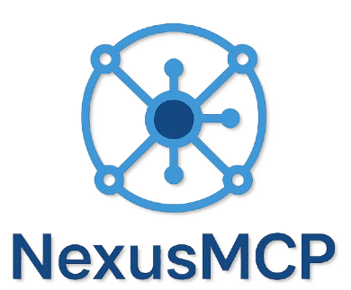
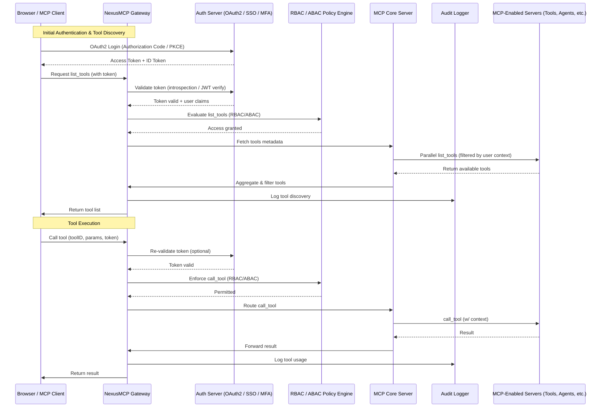

<div align="center">
  
  <h1>NexusMCP</h1>
  <p><em>Enterprise AI Middleware Platform for Model Context Protocol</em></p>

  <p>
    <a href="https://github.com/veerababumanyam/NexusMCP/releases/tag/v0.0.1"></a>
    <a href="LICENSE"></a>
    <a href="#"></a>
    <a href="#"></a>
  </p>
</div>

---

## 🚀 Overview

NexusMCP is a modular, enterprise-ready AI middleware platform designed to unify access to distributed Model Context Protocol (MCP) servers, business intelligence tools, data storage layers, and other integrated services through secure, policy-driven orchestration.

<div align="center">
  <table>
    <tr>
      <td align="center">🔒 <b>Enterprise Security</b></td>
      <td align="center">🌐 <b>Scalable Architecture</b></td>
      <td align="center">🔄 <b>Real-time Collaboration</b></td>
    </tr>
    <tr>
      <td align="center">🛠️ <b>Advanced Tools</b></td>
      <td align="center">📊 <b>Comprehensive Analytics</b></td>
      <td align="center">🔍 <b>Automated Monitoring</b></td>
    </tr>
  </table>
</div>

## 🔄 Data Flow



## ✨ Key Features

<div align="center">
  <h2>🏢 Workspace Management</h2>
  <h3>The Core of NexusMCP's Enterprise Offering</h3>
</div>

<div style="border: 2px solid #4a6cf7; border-radius: 8px; padding: 20px; margin: 20px 0; background-color: #f8f9fe;">

### 🏢 Workspace Management (Enterprise Core)

Workspaces are the multi-tenant backbone of NexusMCP, allowing complete isolation and delegation of services, roles, and integrations per group, team, or client.

#### Key Capabilities:

##### 🔹 Tenant Isolation
- Every workspace is a logically isolated environment
- Separate RBAC, policies, secrets, audit logs, tools, and tokens
- Full data and access segregation between workspaces

##### 🔹 Scoped Roles & Permissions
- Users can have different roles across workspaces
- Fine-grained controls using RBAC + ABAC at workspace level
- Custom permission sets per workspace

##### 🔹 Workspace-Specific Integrations
- Tools, BI systems, and secrets can be configured per workspace
- No cross-contamination of configs or data
- Workspace-specific connections to external systems

##### 🔹 Admin Delegation
- Workspace Admins can manage their own users, roles, policies, and tools
- No need for global admin involvement
- Delegated administration for enterprise-scale deployments

##### 🔹 Dynamic Context Switching
- Seamless switch between workspaces via dropdown in UI
- Context-aware UI & API responses
- Persistent workspace context across sessions

##### 🔹 Audit & Monitoring Per Workspace
- All activities scoped to workspace ID for easier compliance and observability
- Workspace-level reporting and analytics
- Isolated audit trails for regulatory compliance
</div>

### 🔐 Authentication & Authorization

- **OAuth 2.0 / OpenID Connect** with support for:
  - Authorization Code Flow (for web apps)
  - Client Credentials Flow (for backend services)
  - SSO, MFA, and token refresh
- **RBAC & ABAC Enforcement**
  - Role and attribute-based permissions
  - Per-route, per-action, and per-tool access policies
- **Identity Providers Integration**
  - Compatible with Okta, Auth0, Azure AD, Google Workspace, etc.

### 🔧 API Gateway (NexusMCP Gateway)

- **Centralized gateway** to:
  - Authenticate users
  - Enforce policies
  - Route traffic to MCP servers or backend services
  - Log all activities
- Load balancing, rate limiting, audit logging, and secure key vault management

### 🖥️ MCP Server Management

- Connect and manage AI model servers with OAuth 2.1 flow for secure, token-based authentication
- Easily organize servers into workspaces and monitor performance metrics in real-time
- Seamless integration with various AI provider endpoints

### 🔒 Enterprise-Grade Security

- **Security Scanner System**: Continuously scan for vulnerabilities
- **Breach Detection System**: Identify and respond to security threats in real-time
- **Permission-Based Access Control**: Granular control with workspace isolation
- **Key Vault**: Secure storage for secrets, API keys and credentials

### 🔄 WebSocket Connection Management

- Enhanced connection stability with automatic recovery and load balancing
- Performance optimization for real-time communications
- Persistent connections with retry mechanisms

### 🛠️ Integration Modules

- **Business Intelligence (BI) Tools**
  - Power BI, Tableau, Looker, Qlik
  - Export data to warehouse/lake or query directly
- **Data Storage & Warehousing**
  - AWS S3, GCS, ADLS, Snowflake, Redshift, BigQuery
  - ETL/ELT support with tools like Fivetran, Talend, Boomi
- **Secret Management**
  - Centralized, secure storage of API keys and credentials
  - Auto-mounting to integrations and tools
  - Vault or Secrets Manager integration

### 👥 Role & Access Management

- `/access-manager/role-management` – Define and assign roles, map permissions
- `/roles` – View and manage system-level roles
- Seamless UI for workspace-based role bindings
- Role-based collaboration with shared workspaces and annotations

### 📦 Modular Integration Tabs

- Accessible under `/integrations/logging`
- **Tabs**:
  - BI Tools
  - Databases
  - File Storage
  - Data Warehouse
  - Logging / APM
- Single-page layout with tab-based UX for better discoverability

### 📚 Observability & Audit Logging

- Real-time logging of:
  - User logins and token validation
  - Tool invocations and access attempts
- Export to SIEM/logging platforms
- Dashboard visibility into events and user activity
- Tamper-proof audit trail for compliance

## 🏗️ Architecture

NexusMCP is built on a distributed microservices architecture following these principles:

- **Zero Trust Security** – Verify every access attempt
- **Event-Driven Design** – Responsive and scalable
- **Domain-Driven Design (DDD)** – Business-focused modeling
- **Test-Driven Development (TDD)** – Quality from the start
- **Behavior-Driven Development (BDD)** – User-centered approach

## 🛡️ Standards Compliance

- ISO 27001/27002
- OWASP Top 10
- NIST Cybersecurity Framework
- GDPR, SOC 2, CCPA, HIPAA

## 💻 Technology Stack

<div align="center">
  <table>
    <tr>
      <td align="center"><b>Frontend</b></td>
      <td>React, TypeScript, Shadcn UI, TailwindCSS</td>
    </tr>
    <tr>
      <td align="center"><b>Backend</b></td>
      <td>Express.js, Node.js</td>
    </tr>
    <tr>
      <td align="center"><b>Database</b></td>
      <td>PostgreSQL with Drizzle ORM</td>
    </tr>
    <tr>
      <td align="center"><b>Authentication</b></td>
      <td>JWT, OAuth 2.1</td>
    </tr>
    <tr>
      <td align="center"><b>Real-time</b></td>
      <td>WebSockets, SSE</td>
    </tr>
  </table>
</div>

## 🚀 Getting Started

### Prerequisites

- Node.js 20+
- PostgreSQL 15+

### Installation

```bash
# Clone the repository
git clone https://github.com/veerababumanyam/NexusMCP.git
cd NexusMCP

# Install dependencies
npm install

# Setup database
npm run db:push

# Seed database with initial data
npm run db:seed

# Start development server
npm run dev
```

Your application should now be running at `http://localhost:3000`

## 📄 License

This project is licensed under the MIT License - see the [LICENSE](LICENSE) file for details.

## 🤝 Contributing

We welcome contributions! Please read [CONTRIBUTING.md](CONTRIBUTING.md) for details on our code of conduct and the process for submitting pull requests.

---

<div align="center">
  <p>Built with ❤️ by the NexusMCP Team</p>
</div> 
